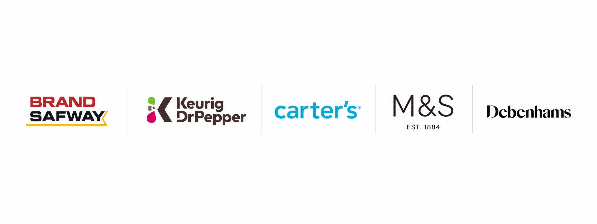

# Manmohan Singh

### Frontend Architect • Engineering Leader • AI-Driven Software Engineering

*Building software that scales. Building systems that last.*

> **Engineering DNA**  
> Architecture • Scalability • Engineering Excellence • Automation • AI • Developer Productivity

---

## Engineering Profile

I'm a Frontend Architect with **18+ years** of experience designing enterprise-scale digital platforms, modernizing frontend architectures, and leading distributed engineering teams. I specialize in building scalable systems, improving developer productivity, and enabling engineering excellence through architecture, automation, and AI-assisted software development.

---

## Engineering Capabilities

| Domain | Technologies |
| :--- | :--- |
| **Frontend** |      |
| **Backend** |    |
| **Cloud** |  |
| **Architecture** |    |
| **Engineering Excellence** |     |

---

## Engineering Philosophy

> **Think → Design → Document → Implement → Validate → Review → Improve**

Great architecture enables teams.

Great engineering enables businesses.

---

## Current Focus

- 🤖 AI-Driven Software Engineering
- 🏗️ Enterprise Frontend Architecture
- ⚙️ Engineering Productivity & Automation
- 📐 System Design & Architecture Documentation

---

## Organizations & Brands I've Worked With

  

I've contributed to enterprise platforms across retail, consumer goods, financial services, telecommunications, and construction, focusing on architecture modernization, cloud adoption, engineering excellence, and scalable frontend platforms.

---

## Principles I Value

- 🏛️ Architecture over complexity
- 📚 Documentation over tribal knowledge
- ⚙️ Automation over repetition
- ✅ Quality over shortcuts
- 🎯 Systems over motivation
- 📈 Continuous learning over comfort

---

## Let's Connect

  
  &nbsp;
  
  &nbsp;
  

